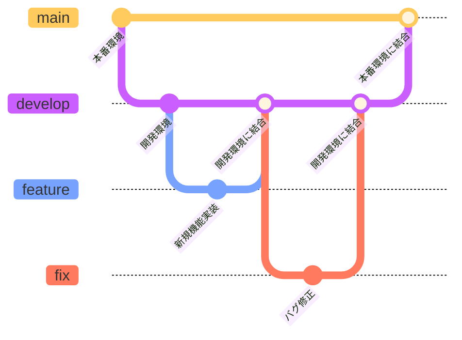

## アプリケーション概要

本アプリケーションは、社内向けのヘルプデスク業務を効率化するための
チケット管理システムです。

社員からの問い合わせをチケットとして登録・管理し、
サポート担当者および管理者が対応状況を一元的に把握・更新できることを目的としています。

ユーザーの権限（社員／サポート担当／システム管理者）に応じて
利用可能な機能や表示内容が切り替わる設計となっています。

## 利用想定

- 社員は、業務上の問い合わせやトラブルをチケットとして登録し、
  　自身が作成したチケットの状況を確認できます。

- サポート担当者は、社員から登録されたチケットを取得・担当し、
  　ステータス更新やコメントを通じて対応を行います。

- システム管理者は、全チケットの管理に加えて、
  　ユーザーアカウントの登録・停止・再開などの管理操作を行います。

## 使用技術

### フロントエンド

- React
- TypeScript
- React Router
- Chakra UI
- React Query
- Axios
- Zod

### 開発・品質管理

- Vite
- Yarn
- ESLint / Prettier
- Vitest
- Playwright

## ディレクトリ構成

```bash
src/
├─ components/
├─ core/
├─ features/
├─ models/
├─ routes/
├─ services/
└─ share/
```

### 主要ディレクトリの役割

- components：複数画面で使い回す共通UIコンポーネント
- core：アプリ全体の初期設定・土台となる処理
- features：機能単位で UI / ロジック / hooks をまとめるフォルダ
- models：アプリケーション内で使用するデータ構造を型として定義・管理
- routes：URL パスと画面（Container）の対応関係を管理
- services：バックエンド・外部サービスとの通信処理
- share：定数・型・共通ロジックなど、全体で共有するもの

<details>
<summary>ディレクトリ構成の方針</summary>

<h3>models（モデル定義）</h3>

<pre><code>src/models/
</code></pre>

<p>
アプリケーション内で使用するデータ構造を型として定義・管理します。<br />
主にバックエンドとのデータの受け渡しや、画面表示に必要なモデルを扱います。
</p>

<hr />

<h3>components（共通UIコンポーネント）</h3>

<pre><code>src/components/
</code></pre>

<p>
画面をまたいで再利用される UI コンポーネントを配置します。
</p>

<p>
Atomic Design の5階層（Atoms / Molecules / Organisms / Templates / Pages）を、
React コンポーネントのディレクトリ構造に反映しています。
</p>

<ul>
  <li>atoms：最小単位のUI（Button / Input / Badge など）</li>
  <li>molecules：atomsの組み合わせ</li>
  <li>organisms：意味を持つUIブロック</li>
  <li>templates：レイアウト構造</li>
  <li>pages：画面単位の見た目</li>
</ul>
<hr />

<h3>features（機能単位）</h3>

<pre><code>src/features/
</code></pre>

<p>
機能・ユースケース単位でコードをまとめるフォルダです。<br />
features 配下にはページ（画面）単位でフォルダを作成し、<br />
各ページに関する UI、ロジック、状態管理などを機能ごとに閉じ込めます。
</p>

<hr />

<h3>routes（ルーティング管理）</h3>

<pre><code>src/routes/
</code></pre>

<p>
アプリ全体のルーティング定義を管理します。<br />
URL と画面の対応関係はこのフォルダ配下で集約します。
</p>

<hr />

<h3>services（通信・外部連携）</h3>

<pre><code>src/services/
</code></pre>

<p>
バックエンドや外部サービスとの通信処理を管理します。<br />
API クライアントや通信ロジックはここに集約します。
</p>

<hr />

<h3>share（全体共有）</h3>

<pre><code>src/share/
</code></pre>

<p>
アプリ全体で共通利用される定義を配置します。
</p>

<ul>
  <li>constants：固定値・定数</li>
  <li>types：複数機能で共有する型定義</li>
  <li>logic：共通ロジックやユーティリティ</li>
</ul>

</details>

## 前提条件

本プロジェクトをローカルで開発するためには、以下の環境が必要です。

- Node.js（v24.12.0）
- Yarn

※ 上記の環境構築手順が分からない場合は、以下を参照してください。

<details>
<summary>前提条件・環境構築手順（Node.js / Yarn が未インストールの場合）</summary>
<h3>必要な環境</h3>

<ul>
  <li>OS：macOS / Windows / Linux（動作確認・手順例は macOS）</li>
  <li>Node.js：<strong>v24.12.0</strong></li>
  <li>パッケージマネージャ：Yarn</li>
</ul>

<p>
本プロジェクトでは、Node.js のバージョン差異による不具合を防ぐため、
<strong>Node.js のバージョンを完全に揃えること</strong>を前提としています。
</p>

<p>
以下では、<strong>nodebrew を利用して Node.js を管理する方法</strong>を例に説明します。
</p>

<p>
Windows / Linux 環境については、各OSに適した Node.js バージョン管理ツールを使用し、
上記と同一の Node.js バージョンを設定してください。
</p>

<hr />

<h3>1. nodebrew のインストール</h3>

<pre><code>brew install nodebrew
</code></pre>

<p>
nodebrew は、Node.js 本体ではなく、
<strong>Node.js のバージョンを管理・切り替えるためのツール</strong>です。
</p>

<hr />

<h3>2. インストール可能な Node.js バージョンの確認</h3>

<pre><code>nodebrew ls-remote
</code></pre>

<p>
指定バージョン（v24.12.0）がインストール可能かを確認します。
</p>

<hr />

<h3>3. Node.js のインストール（バイナリ版）</h3>

<pre><code>nodebrew install-binary v24.12.0
</code></pre>

<hr />

<h3>4. インストール済み Node.js の確認</h3>

<pre><code>nodebrew list
</code></pre>

<p>
インストール済みの Node.js バージョン一覧を確認します。
</p>

<hr />

<h3>5. 使用する Node.js バージョンの切り替え</h3>

<pre><code>nodebrew use v24.12.0
</code></pre>

<p>
切り替え後、以下でバージョンを確認してください。
</p>

<pre><code>node -v
</code></pre>

<hr />

<h4>yarn のインストール</h4>

<pre><code>npm install -g yarn
</code></pre>

<p>
インストール後、以下のコマンドで yarn が使用できることを確認してください。
</p>

<pre><code>yarn -v
</code></pre>

<hr />

<h4>（任意）グローバル npm パッケージの確認</h4>

<pre><code>npm list -g --depth=0
</code></pre>

<hr />

</details>

## 環境構築手順

### 1. リポジトリをクローン

```bash
git clone https://github.com/nana-ichimaru/Helpdesk-FE.git
cd Helpdesk-FE
```

### 2. 依存関係のインストール

```bash
yarn install
```

### 3. 開発サーバーの起動

```bash
yarn dev
```

## ブランチ運用ルール

### ブランチ運用ルールの目的

本ルールは、開発チームが効率的かつ安定して開発を進められるよう、  
GitHub リポジトリにおけるブランチ運用方法を明確に定義することを目的としています。

開発フローに即したブランチ戦略を明文化し、コードレビューおよびリリース手順を統一することで、  
品質の維持、作業の重複防止、コンフリクトの最小化を図ります。

また、チーム全員が共通のルールに基づいて開発を行うことで、  
スムーズなコラボレーションと安定したリリースサイクルの実現を目指します。

### ブランチ名・概要

- `main`  
  リリース用ブランチ。リリース時に `develop` ブランチをマージする。

- `develop`  
  開発用の統合ブランチ。新規機能開発やバグ修正が完了した各ブランチをマージする。

- `feature/*`  
  新規機能の実装を行うためのブランチ。

- `fix/*`  
  バグ修正を行うためのブランチ。

### 使用時のルール

#### 1. マージ、被マージの流れ

- `main`
  - リリース用ブランチとして扱う
  - 原則として直接の作業・直接 push は行わない

- `develop`
  - 新規機能・バグ修正の確認が完了した段階で、`main` へマージする
  - `main` へのマージはリリースタイミングでのみ行う
- `feature/<チケット番号(IIS-xx)>-<簡単な機能名>`
  - 作成元：`develop`
  - マージ先：`develop`
  - 新規機能の実装が完了したら、`develop` 宛てに Pull Request を作成する

- `fix/<チケット番号(IIS-xx)>-<不具合名>`
  - 作成元：`develop`
  - マージ先：`develop`
  - バグ修正が完了したら、`develop` 宛てに Pull Request を作成する

#### 2. タスクに対する使用の流れ

- 原則として **1タスクにつき1ブランチ**を作成する
- 新規機能の場合は `feature/*` ブランチを使用する
- バグ修正の場合は `fix/*` ブランチを使用する
- ブランチ名は、タスク内容が分かる名称とする
- 作業完了後は Pull Request を作成し、レビューを経て `develop` にマージする

#### 3. 禁止事項

- `main` および `develop` ブランチへの直接 push を禁止する
- レビューを経ずに Pull Request をマージすることを禁止する
- 複数タスクを1つのブランチで同時に対応することを禁止する
- 用途が不明確なブランチ（例：`test`、`tmp` など）の作成を禁止する

#### 4. 例外ルール

本ルールに該当しない対応が必要な場合は、  
レビュー担当者に共有したうえで対応すること。

### ブランチ名命名規則

ブランチ名は、以下の形式に従って命名してください。

- 新規機能開発（`feature/*`）
  - `feature/<チケット番号(IIS-xx)>-<簡単な機能名>`
  - 例：`feature/IIS-12-user-login`

- バグ修正（`fix/*`）
  - `fix/<チケット番号(IIS-xx)>-<不具合名>`
  - 例：`fix/IIS-34-login-error`

#### 命名ルール補足

- チケット番号は必ず含めること
- 機能名・不具合名は内容が分かる簡潔な英語表記とする
- 単語の区切りにはハイフン（`-`）を使用する
- 大文字・日本語・アンダースコア（`_`）の使用は避ける



## Linter / Formatter 設定について

### 使用目的

開発者全員が同一の Linter / Formatter を使用して開発を行うことで、  
コード品質を一定に保ち、コードの書き方の違いによる修正差分を防ぐことを目的としています。

---

### 採用した理由

- 開発者ごとの書き方やエディタ設定の違いをなくすため
- ドキュメント通りに実行すれば、同じ結果が再現できるようにするため

---

### 実行コマンド

#### ESLint（Lint チェック）

```bash
yarn lint
```

- ESLint をプロジェクト全体に実行し、ルール違反を確認します
- ファイルの書き換えは行いません

#### ESLint（Lint）

```bash
yarn lint:fix
```

- ESLint をプロジェクト全体に実行
- 修正可能なルール違反は自動修正されます

#### **Prettier（Format チェック）**

```
yarn format
```

- フォーマットがルールに沿っているかを確認します
- ファイルの書き換えは行いません
- VS Code で保存した場合も自動で同じフォーマットが適用されます。

#### **Prettier（Format 修正）**

```
yarn format:fix
```

- プロジェクト全体を Prettier のルールに従って自動整形します
